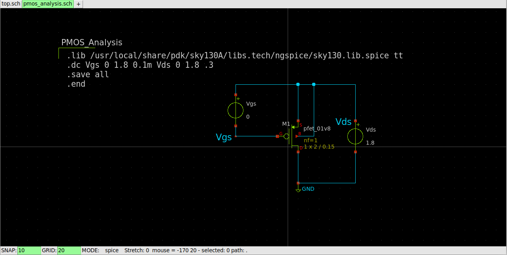
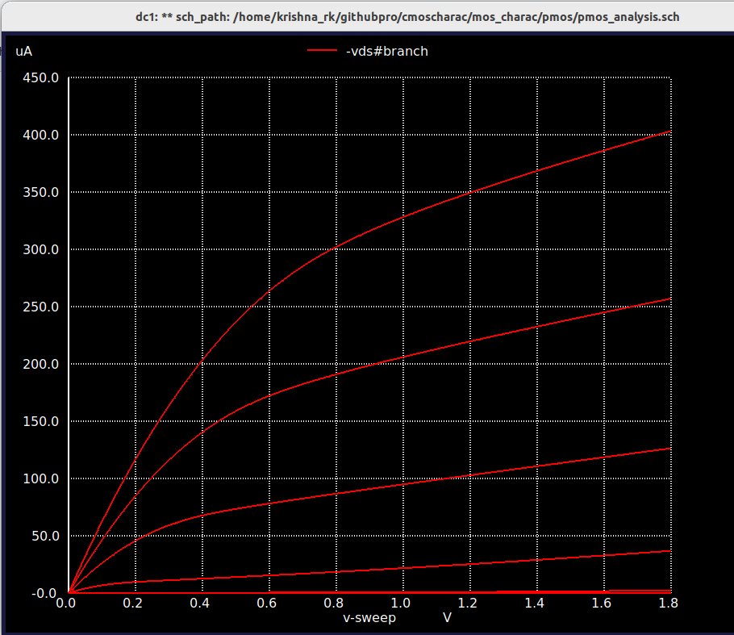
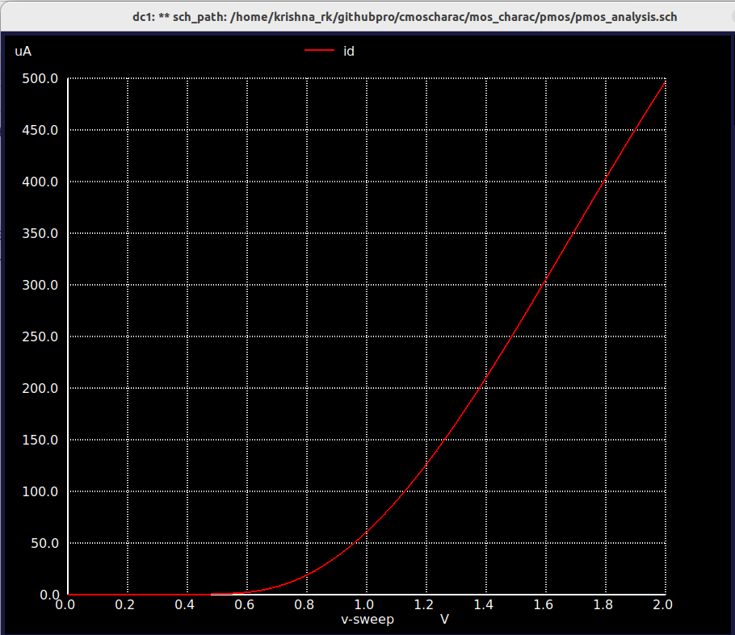
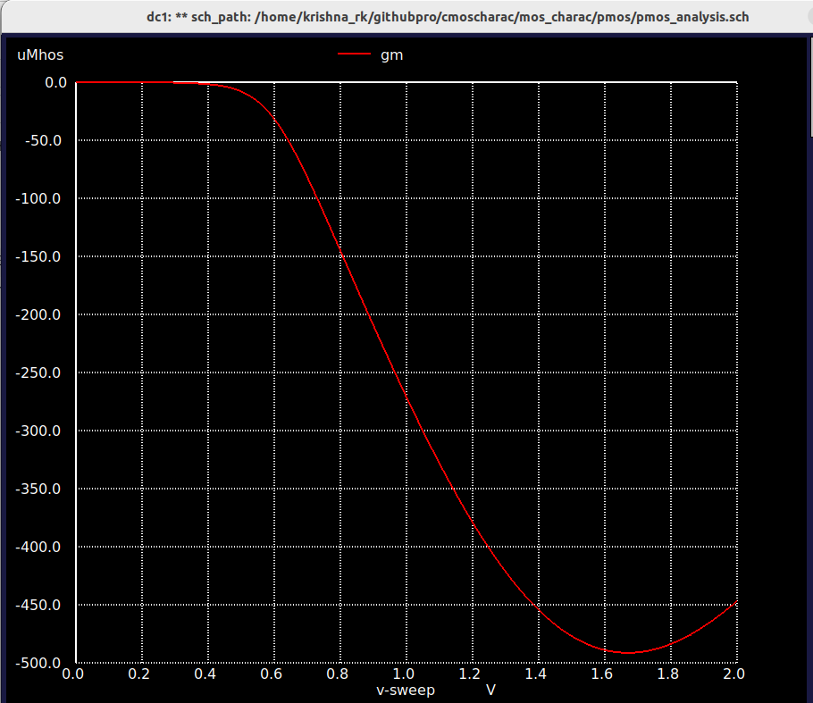
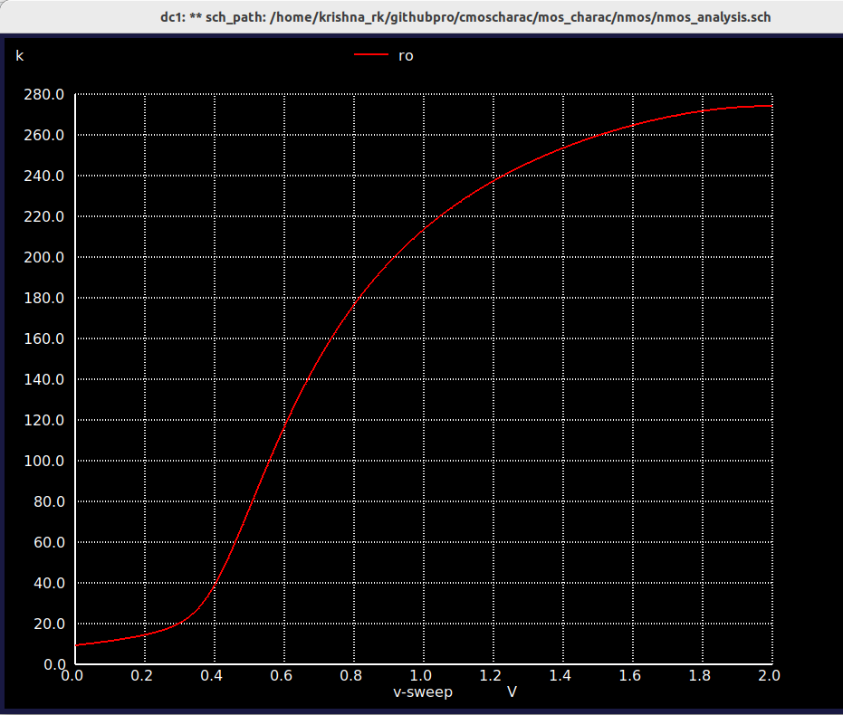

# Characteristics of MOS Devices Utilizing SKY130 Process Design Kit with Xschem and Ngspice

**This project focuses on the analysis of MOSFET characteristics, specifically PMOS and NMOS transistors. Using the SkyWater 130nm Process Design Kit (PDK), we design circuits with Xschem and perform detailed simulations with Ngspice. The goal is to understand the behavior of MOS transistors through their drain and transfer characteristics. This foundational analysis aids in designing more complex CMOS circuits in future projects.**

## Contents
### [1. Introduction](#intro)

- [1.1. Objective](#obj)

### [2. Tools and PDK](#tool)

- [2.1 SKY130PDK](#sky)
- [2.2 Xschem](#xschem)
- [2.3 Ngspice](#ngspice)

### [3. Analysis of PMOS Circuit](#pmos)

- [3.1 PMOS Circuit Analysis](#pmoscircuit)
- [3.2 Transfer and Drain Characteristics](#pmostd)
- [3.3 Analysis of Gm and Ro](#pmosgm)

### [4. Analysis of NMOS Circuit](#nmos)

- [4.1 NMOS Circuit Analysis](#nmoscircuit)
- [4.2 Transfer and Drain Characteristics](#nmostd)
- [4.3 Analysis of Gm and Ro](#nmosgm)

### [5. Conclusion](#conclude)

## [1. Introduction](#intro)
  This project focuses on the analysis and design of MOS characteristics, specifically utilizing the SkyWater 130nm Process Design Kit (PDK). By employing Xschem for circuit design and Ngspice for simulation, we explore the fundamental drain and transfer characteristics of PMOS and NMOS transistors. Additionally, we delve into the analysis of Level 2 parameters, such as transconductance (gm) and output resistance (ro), within the small signal model. This comprehensive study aims to enhance our understanding of MOSFET behavior, providing critical insights for more advanced CMOS circuit design in future projects.

### [1.1. Objective](#obj)

The primary objectives include experimental determination and analysis of MOS transistor characteristics, circuit design using Xschem, simulation using Ngspice, and enhancing understanding of CMOS circuits for advanced VLSI projects.

1. **Experimentation and Analysis:** To experimentally determine and analyze the drain and transfer characteristics of PMOS and NMOS transistors using SkyWater PDK 130nm technology.

2. **Circuit Design:** To design the necessary circuits using Xschem, ensuring accurate representation of PMOS and NMOS behaviors.

3. **Simulation:** To perform simulations using Ngspice to validate the designed circuits and to extract the key characteristics of the transistors.

4. **Understanding CMOS Circuits:** To utilize the insights gained from the analysis of PMOS and NMOS characteristics to enhance understanding of CMOS circuit design and operation, facilitating the development of more complex integrated circuits in future projects.

This project serves as a foundational step towards mastering CMOS circuit design and is crucial for the successful execution of more advanced VLSI design projects.

## [2. Tools and PDK](#tool)

### [2.1 SKY130PDK](#sky)

The [SkyWater 130nm Process Design Kit (PDK)](https://skywater-pdk.readthedocs.io/en/main/index.html#) is an open-source toolset provided by SkyWater Technology, tailored for semiconductor design at the 130nm technology node. It includes essential components such as design rules, device models, and standard cell libraries. The purpose of the SkyWater 130nm PDK is to enable designers to create and simulate integrated circuits with accuracy and efficiency. It supports both analog and digital circuit design, making it suitable for a wide range of applications from consumer electronics to advanced research in semiconductor technology.

### [2.2 Xschem](#xschem)

[Xschem](https://xschem.sourceforge.io/stefan/index.html) is coupled with the SkyWater 130nm Process Design Kit (PDK) and Ngspice, forms a robust toolchain for VLSI circuit design and simulation. Xschem serves as a powerful schematic capture tool, providing an intuitive interface for designing and analyzing circuits at the transistor level. Integrated with the SkyWater 130nm PDK, Xschem facilitates efficient creation and editing of circuit schematics, ensuring compatibility with specific design rules and device models. Ngspice complements Xschem by enabling accurate simulation of analog and mixed-signal circuits, crucial for predicting and validating circuit behavior before fabrication. Together, they enhance the precision and effectiveness of semiconductor design processes.
**[Learn more about Xschem](https://xschem.sourceforge.io/stefan/xschem_man/xschem_man.html")**

### [2.3 Ngspice](#ngspice)

[Ngspice](https://ngspice.sourceforge.io/) in conjunction with Xschem and the SkyWater 130nm Process Design Kit (PDK), is pivotal for simulating VLSI circuits with precision. It enables thorough analysis of analog and mixed-signal designs, predicting circuit performance and validating functionality before fabrication. Integrated seamlessly with Xschem and utilizing the comprehensive device models and design rules of the SkyWater 130nm PDK, Ngspice supports various simulation types, including transient and AC/DC analyses. This combination ensures that designers can achieve accurate and reliable results, optimizing circuits for performance, power efficiency, and overall design robustness in semiconductor applications.

**[Get Ngspice Manual Here!](https://ngspice.sourceforge.io/docs/ngspice-manual.pdf)**

To install follow **[SKY130 PDK, Xschem and Ngspice](https://xschem.sourceforge.io/stefan/xschem_man/tutorial_xschem_sky130.html)** the instructions provided in this site.
## [3. Analysis of PMOS Circuit](#pmos)

### [3.1 PMOS Circuit Analysis](#pmoscircuit)

Now we have connected the PMOS circuit using the `pfet_01v8` component from the SkyWater 130nm PDK library in Xschem. We apply a negative voltage to Vgs and vary the voltage of Vds to observe the PMOS behavior. Specifically, we vary Vds for different Vgs voltages to understand the PMOS characteristics. In Xschem, create voltage sources and name them Vgs and Vds using the library components. Use the `code_shown.sym` to include the `.lib` of the PDK library for netlist generation. Implement the `.dc` command to create various voltage steps as shown in the above image. After configuring these settings, generate the netlist and simulate the circuit using Ngspice. In the Ngspice terminal, type `display` to list the available plots, use `setplot` to select a specific plot, and then type `plot` followed by the plot name you want to visualize.

The above-mentioned commands are shown on the left side of the image to help you get started with plotting. These include using `display` to list available plots, `setplot` to select a plot, and `plot` followed by the plot name to visualize specific results. Follow these steps in the Ngspice terminal to generate and analyze your simulation data effectively.

### [3.2 Transfer and Drain Characteristics](#pmostd)

#### Transfer Characteristics

The following steps outline the process for plotting and analyzing the PMOS transfer characteristics using the SkyWater 130nm PDK, Xschem, and Ngspice. First, we plot the transfer characteristics, specifically Id versus Vgs, for various Vds voltages. This allows us to understand how the PMOS transistor operates and how the drain current changes in response to different gate-source voltages. By varying the Vds voltage while observing the changes in Id, we gain insights into the transistor's behavior in different operating regions. These plots help us analyze key parameters such as the threshold voltage, transconductance, and output resistance, providing a comprehensive understanding of PMOS performance.

Now, we are plotting the transfer characteristics. Using the commands `display`, `setplot`, and `plot` in the Ngspice terminal, we can visualize these characteristics effectively. After simulating, type `plot vds#branch` to plot the characteristics.

#### Drain Characteristics

To analyze the drain characteristics of PMOS transistors, we configure the `.dc` command within `code_shown.sym` to sweep the gate-source voltage (Vgs). This enables us to plot the drain current (Id) versus drain-source voltage (Vds) across a range of Vgs values, providing detailed insights into the transistor's operational behavior. By employing Ngspice's `plot` and `display` commands to visualize the Id Vs Vds.

### 3.3 Analysis of Gm and Ro](#pmosgm)

#### Analysis of Gm

To calculate the transconductance (gm) of a PMOS transistor, we select the higher Vgs value of -1.8V. Using this gate-source voltage, we plot the drain current (Id) versus drain-source voltage (Vds). Subsequently, we employ the `.measure` command in Ngspice to determine the value of Id at Vgs = -1.8V. The transconductance gm is then calculated using the formula gm = dId / dVgs, where dId represents the change in drain current and dVgs represents the change in gate-source voltage.

At Vgs = -1.8V, we find that Id is approximately 403 µA (microamps), and the transconductance gm measures -483 µS (microsiemens), as displayed in the calculations shown on the left. These steps illustrate how transconductance quantifies the efficiency of a MOSFET in amplifying signals, essential for optimizing circuit performance in various applications.

#### Analysis of Ro

To calculate the output resistance (Ro) of the PMOS transistor, we select a higher drain-source voltage (Vds) of -1.8V. Using this Vds value, we plot the drain current (Id) versus gate-source voltage (Vgs). Next, we use the `.measure` command in Ngspice to determine the Id at Vds = -1.8V. To find Ro, we use the formula Ro = 1 / (d(Id)/d(Vds) * λ). For simplicity, we neglect the channel-length modulation parameter (λ) as it increases the complexity due to Level 3 SPICE parameters.

After performing these calculations, we find that Id at Vds = -1.8V is approximately 403 µA (microamps), and the output resistance Ro is measured to be around 11,954 ohms (Ω). These measurements provide critical insights into the MOSFET's stability and performance in circuit applications. Follow the commands shown on the left side of the screen to accurately perform and verify these calculations in Ngspice.

## [4. Analysis of NMOS Circuit](#nmos)

### [4.1 NMOS Circuit Analysis](#nmoscircuit)

We have connected an NMOS circuit using the `nfet_01v8` component from the SkyWater 130nm PDK library in Xschem. First, we apply a negative voltage to the Vgs terminal with various Vds voltages to observe the NMOS behavior. Next, we vary the Vds voltage for different Vgs values to understand the PMOS characteristics. Create voltage sources and name them Vgs and Vds using the Xschem library. Use `code_shown.sym` to reference the PDK library in the netlist. Employ the `.dc` command to set up various voltage steps as depicted in the image. Generate the netlist and simulate it using Ngspice. In the Ngspice terminal, type `display` to list the available plots, `setplot` to select the plot, and `plot` followed by the plot name to visualize the results.

The above-mentioned commands are shown on the left side of the image to help you get started with plotting. These include using `display` to list available plots, `setplot` to select a plot, and `plot` followed by the plot name to visualize specific results. Follow these steps in the Ngspice terminal to generate and analyze your simulation data effectively.

### [4.2 Transfer and Drain Characteristics](#nmostd)

#### Transfer Characteristics

The following steps outline the process for plotting and analyzing the NMOS transfer characteristics using the SkyWater 130nm PDK, Xschem, and Ngspice. First, we plot the transfer characteristics, specifically Id versus Vgs, for various Vds voltages. This allows us to understand how the NMOS transistor operates and how the drain current changes in response to different gate-source voltages. By varying the Vds voltage while observing the changes in Id, we gain insights into the transistor's behavior in different operating regions. These plots help us analyze key parameters such as the threshold voltage, transconductance, and output resistance, providing a comprehensive understanding of NMOS performance.

Now, we are plotting the transfer characteristics. Using the commands `display`, `setplot`, and `plot` in the Ngspice terminal, we can visualize these characteristics effectively. After simulating, type `plot -vds#branch` (note: for convenience, we use the negative sign) to plot the characteristics.

#### Drain Characteristics

To analyze the drain characteristics of NMOS transistors, we configure the `.dc` command within `code_shown.sym` to vary the gate-source voltage (Vgs). This setup allows us to plot the drain current (Id) versus drain-source voltage (Vds) for different Vgs values, offering detailed insights into the transistor's operational behavior. Using Ngspice's `plot` and `display` commands, we visualize these characteristics to evaluate crucial parameters such as saturation regions, threshold voltages, and current levels under varying bias conditions. After simulation, type `plot -vds#branch` in Ngspice to generate the plot; the negative sign is used for convenient visualization of the plot orientation.

### [4.3 Analysis of Gm and Ro](#nmosgm)

#### Analysis of Gm

To calculate the transconductance (gm) of the NMOS transistor, we select a higher gate-source voltage (Vgs) of 1.8V. Using this Vgs value, we plot the drain current (Id) versus drain-source voltage (Vds). Next, we use the `.measure` command in Ngspice to determine the Id at Vgs = 1.8V. To find gm, we differentiate Id with respect to Vgs using the formula gm = d(Id)/d(Vgs).

After performing these calculations, we find that Id at Vgs = 1.8V is approximately 500 µA (microamps), and the transconductance gm is measured to be around 532 µS (microsiemens). These measurements provide crucial insights into the MOSFET's amplification capability and are essential for optimizing circuit performance in various applications. Follow the commands shown on the left side of the screen to accurately perform and verify these calculations in Ngspice.

#### Analysis of Ro

To calculate the output resistance (Ro) of the NMOS transistor, we select a higher drain-source voltage (Vds) of 1.8V. Using this Vds value, we plot the drain current (Id) versus the drain-source voltage (Vds). Next, we use the `.measure` command in Ngspice to determine the Id at Vds = 1.8V. To find Ro, we use the formula Ro = 1 / (d(Id) * λ), where λ is the channel-length modulation parameter. However, for simplicity, we neglect λ due to the complexity introduced by the Level 3 SPICE parameters. 

After performing these calculations, we find that Id at Vds = 1.8V is approximately 500 µA (microamps), and the output resistance Ro is measured to be around 19,306 Ω (ohms). Understanding Ro is essential for assessing the stability and performance of the MOSFET in various circuit applications. Follow the commands shown on the left side of the screen to accurately perform and verify these calculations in Ngspice.

## [5. Conclusion](#conclude)
