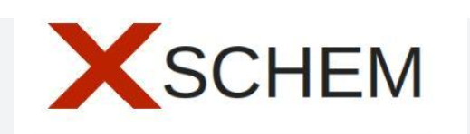
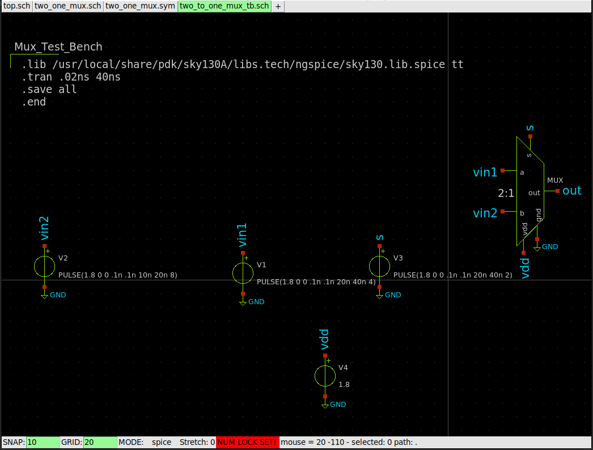

# Design and Analysis of 8-bit Carry Select Adder: Schematic Design, Layout Design and LVS Validation using SKY130PDK

#### In this project, we developed an 8-bit Carry Select Adder (CSA) following a complete design flow. We began with the schematic design using Xschem and validated it with Ngspice simulations. The behavioral design was implemented in Verilog and synthesized to the gate level using Yosys. The layout was created in Magic VLSI, and Layout Versus Schematic (LVS) validation was performed using Netgen. This project demonstrates the full CSA design process, from schematic and behavioral design to physical implementation and verification. 

## Contents
- [1. Introduction](#1-Introduction)
  - [1.1. Objective](#11-Objective)

- [2. Tools and PDK](#2-Tools-and-PDK)
  - [2.1 SKY130PDK](#21-SKY130PDK)
  - [2.2 Icarus Verilog](#22-Icarus-Verilog)
  - [2.3 GTK Wave](#23-GTK-Wave)
  - [2.4 Yosys](#24-Yosys)
  - [2.5 Xschem](#25-Xschem)
  - [2.6 Ngspice](#26-Ngspice)
  - [2.7 Magi VLSI](#27-Magi-VLSI)
  - [2.8 Netgen](#28-Netgen)

- [3. RTL Design](#3-RTL-Design)
  - [3.1 CSA HDL Description](#31-CSA-HDL-Description)
  - [3.2 Gate Level Synthesis](#32-Gate-Level-Synthesis)

- [4. Multiplexer Schematic and Layout Design](#4-Multiplexrer-Schematic-and-Layout-Design)
  - [4.1 MUX Schematic Design](#41-Schematic-Design)
  - [4.2 MUX Layout Design](#42-Layout-Design)
  - [4.3 MUX Layout Versus Schematic(LVS)](#43-Layout-Versus-Schematic(LVS))

- [5. Full Adder Schematic and Layout Design](#5-Full-Adder-Schematic-and-Layout-Design)
  - [5.1 FA Schematic Design](#51-Schematic-Design)
  - [5.2 FA Layout Design](#52-Layout-Design)
  - [5.3 FA Layout Versus Schematic(LVS)](#53-Layout-Versus-Schematic(LVS))
 
- [6. CSA Schematic and Layout Design](#6-CSA-Schematic-and-Layout-Design)
  - [6.1 CSA Schematic Design](#61-Schematic-Design)
  - [6.2 CSA Layout Design](#62-Layout-Design)
  - [6.3 CSA Layout Versus Schematic(LVS)](#63-Layout-Versus-Schematic(LVS))
  
- [7. Conclusion](#7-Conclusion)

  ## 1. Introduction

  In this project, we designed an 8-bit Carry Select Adder (CSA) following a comprehensive VLSI design flow. A Carry Select Adder is an efficient adder design used in digital circuits to speed up the process of addition by calculating multiple carries in parallel. It reduces the delay by independently calculating the sum and carry for different possible carry inputs and then selecting the correct output using multiplexers. We began our project with the schematic design using Xschem and performed simulations using Ngspice to validate the functionality of the circuit at the transistor level. The behavioral design was implemented using Verilog, and we synthesized the gate-level netlist using Yosys, an open-source synthesis tool.
  
  For layout design, we utilized Magic VLSI to create the physical layout, ensuring design rules and performance criteria were met. Layout versus schematic (LVS) validation was conducted using Netgen to confirm that the layout accurately represents the schematic design. Throughout the project, we employed the open-source SKY130 Process Design Kit (PDK) to leverage industry-standard technology in an accessible manner. Each step of the process, from schematic capture and simulation to synthesis, layout, and validation, was meticulously executed and documented, demonstrating a complete design flow of a CSA using state-of-the-art open-source tools.

## 2. Tools and PDK

### 2.1 SKY130PDK

The [SkyWater 130nm Process Design Kit (PDK)](https://skywater-pdk.readthedocs.io/en/main/index.html#) is an open-source toolset provided by SkyWater Technology, tailored for semiconductor design at the 130nm technology node. It includes essential components such as design rules, device models, and standard cell libraries. The purpose of the SkyWater 130nm PDK is to enable designers to create and simulate integrated circuits with accuracy and efficiency. It supports both analog and digital circuit design, making it suitable for a wide range of applications from consumer electronics to advanced research in semiconductor technology.

### 2.2 Icarus Verilog

[Icarus Verilog ](https://iverilog.fandom.com/wiki/Installation_Guide)is an open-source Verilog simulation and synthesis tool. It supports both the IEEE-1364 and IEEE-1800 standards, providing a robust environment for compiling and simulating Verilog designs. Icarus Verilog is widely used in educational and research settings due to its flexibility and free availability.

### 2.3 GTK Wave

[GTKWave ](https://gtkwave.sourceforge.net/)is an open-source waveform viewer that allows users to view simulation results of digital circuits. It supports several waveform formats, including VCD (Value Change Dump) files, which are commonly generated by simulators like Icarus Verilog. GTKWave provides a user-friendly interface for analyzing signal transitions and debugging digital designs.

### 2.4 Yosys

[Yosys](https://yosyshq.net/yosys/) is an open-source framework for Verilog RTL synthesis. It allows designers to convert Verilog code into gate-level netlists, supporting various FPGA and ASIC technologies. Yosys is highly extensible, offering a modular architecture that enables users to add custom synthesis algorithms and optimizations. It is widely used in conjunction with other open-source EDA tools for complete digital design workflows.

### 2.5 Xschem

[Xschem](https://xschem.sourceforge.io/stefan/index.html) is coupled with the SkyWater 130nm Process Design Kit (PDK) and Ngspice, forms a robust toolchain for VLSI circuit design and simulation. Xschem serves as a powerful schematic capture tool, providing an intuitive interface for designing and analyzing circuits at the transistor level. Integrated with the SkyWater 130nm PDK, Xschem facilitates efficient creation and editing of circuit schematics, ensuring compatibility with specific design rules and device models. Ngspice complements Xschem by enabling accurate simulation of analog and mixed-signal circuits, crucial for predicting and validating circuit behavior before fabrication. Together, they enhance the precision and effectiveness of semiconductor design processes.
**[Learn more about Xschem](https://xschem.sourceforge.io/stefan/xschem_man/xschem_man.html")**

### 2.6 Ngspice

[Ngspice](https://ngspice.sourceforge.io/) in conjunction with Xschem and the SkyWater 130nm Process Design Kit (PDK), is pivotal for simulating VLSI circuits with precision. It enables thorough analysis of analog and mixed-signal designs, predicting circuit performance and validating functionality before fabrication. Integrated seamlessly with Xschem and utilizing the comprehensive device models and design rules of the SkyWater 130nm PDK, Ngspice supports various simulation types, including transient and AC/DC analyses. This combination ensures that designers can achieve accurate and reliable results, optimizing circuits for performance, power efficiency, and overall design robustness in semiconductor applications.

**[Get Ngspice Manual Here!](https://ngspice.sourceforge.io/docs/ngspice-manual.pdf)**

### 2.7 Magi VLSI

[Magic VLSI](http://opencircuitdesign.com/magic/) is an open-source layout tool for designing and editing integrated circuit layouts. It is particularly known for its simple and intuitive user interface. Magic supports various fabrication technologies, including the SKY130 PDK, and provides features for design rule checking (DRC), layout versus schematic (LVS) checking, and extraction of circuit parameters.

### 2.8 Netgen

[Netgen](http://opencircuitdesign.com/netgen/) is an open-source tool for comparing netlists and performing layout versus schematic (LVS) checks. It verifies that the physical layout of a circuit matches its schematic design. Netgen is compatible with multiple EDA tools and supports integration with Magic VLSI for comprehensive design verification.

To install follow **[All Tools](https://xschem.sourceforge.io/stefan/xschem_man/tutorial_xschem_sky130.html)** the instructions provided in this site.

## 3. RTL Design

### 3.1 CSA HDL Description

A Carry Select Adder (CSA) accelerates the addition process by dividing it into smaller blocks, enabling parallel computation. The 8-bit CSA consists of a lower block and an upper block, each responsible for computing 4-bit operations. The lower block processes the least significant 4 bits without needing separate carry inputs of 0 and 1. The CSA utilizes ripple carry adders and multiplexers. The LSB block operates as a standard Ripple Carry Adder. The MSB block performs two parallel computations: one with the carry input set to 0 and the other with the carry input set to 1. When a carry is generated in the LSB block, the multiplexer selects the appropriate carry-out value based on this input.

The **[HDL description](assets/files/verilog/csa.v)** of the CSA is provided. A **[Test bench](assets/files/verilog/csa_tb.v)** was developed to verify the design, obtaining simulation results in .vcd format, which were analyzed using GTKWave.

### 3.2 Gate Level Synthesis

Using Yosys, gate-level synthesis of the CSA was performed, producing outputs in two formats: .dot and .json. The .dot format provides a graphical representation of the gate-level design, suitable for visualization with GraphViz. The .json format provides a structured data representation, enabling further analysis and processing. Both synthesis formats are depicted in the accompanying image.

#### NetlistSVG:

##### GraphViz:

## 4. Multiplexer Schematic and Layout Design

### 4.1 MUX Schematic Design

A 2-to-1 multiplexer schematic was created in Xschem. The circuit design incorporates symmetric gates assigned to PMOS and NMOS transistors, creating a reusable Xschem symbol for consistent use across the design. The multiplexer symbol is saved as mux2to1.sym. A test bench was developed to verify the multiplexer’s functionality, with inputs and outputs demonstrated in the test bench.

Multiplexers are integral to digital circuits, selecting one of several input signals and forwarding the chosen input to a single output line, thereby facilitating decision-making processes within the circuit.

### 4.2 MUX Layout Design

The layout for the multiplexer was meticulously drawn in Magic VLSI using Metal 1 and Local Interconnect (LI) layers, as specified by the SkyWater 130nm Process Design Kit (PDK). This layout was saved as a .mag file for incorporation into the CSA Layout module. The layout was also extracted to a .ext file and converted to SPICE format for further analysis. The associated files are attached for reference.
#### [Magic VLSI .spice File:](assets/files/mux_2to1_layout/mux_2to1.spice)

### 4.3 MUX Layout Versus Schematic(LVS)

The extracted SPICE file from Magic VLSI was simulated and compared with the schematic design using Ngspice. This comparison ensures that the physical layout accurately represents the intended circuit functionality and performance. The LVS process verifies that the design is both logically and physically sound, ensuring that the layout matches the schematic specifications and performs as expected.

## 5. Full Adder Schematic and Layout Design

### 5.1 FA Schematic Design

  The full adder is designed using the generate, propagate, and delete methodology with CMOS logic. This design and implementation will be carried out using the SkyWater 130nm technology, employing eSim and Ngspice software. A full adder is a digital circuit that adds three input bits (A, B, and Cin) and produces two output bits (SUM and CARRY). The full adder performs binary addition, where the SUM output represents the sum of the three inputs, and the CARRY output represents the carry-over bit from the addition.
  
 

In CMOS technology, the full adder design typically involves using complementary pairs of p-type and n-type MOSFETs (PMOS and NMOS) to achieve low power consumption and high-speed operation. The generate, propagate, and delete logic can be implemented using standard CMOS gates to ensure robustness and efficiency.

The full adder schematic is created in Xschem and saved as full_adder.sch. A corresponding symbol is generated to facilitate its integration into the Carry Select Adder (CSA) module. The test bench for the full adder is simulated using Ngspice, verifying the functionality of the design through circuit waveforms. The use of symmetric sizes for both NMOS and PMOS transistors ensures balanced performance and minimal signal distortion.

### 5.2 FA Layout Design

  The layout for the full adder is designed as a full_adder.mag module and implemented in the CSA module using the SkyWater 130nm Process Design Kit (PDK). During layout design, it is crucial to maintain a symmetric width-to-length (W/L) ratio for the transistors to ensure consistent performance. The area of each gate is optimized according to design specifications to achieve a compact and efficient layout.

The layout is extracted to a .ext file using the "extract all" command, and the .ext file is converted to a SPICE file using the ext2spice command for LVS (Layout Versus Schematic) verification.

### 5.3 FA Layout Versus Schematic(LVS)

The SPICE file obtained from the layout design in Magic VLSI is used to perform LVS verification. LVS validation involves comparing the extracted layout netlist with the original schematic netlist to ensure that the physical layout accurately represents the intended circuit design. This process checks for any discrepancies in connectivity, component values, and overall circuit functionality. The SPICE code for LVS testing includes the necessary inputs to simulate the layout and verify that the outputs match those of the schematic design. This thorough validation ensures that the full adder design is both logically and physically consistent, meeting all design requirements and performance criteria.

## 6. CSA Schematic and Layout Design

### 6.1 CSA Schematic Design

### 6.2 CSA Layout Design

### 6.3 CSA Layout Versus Schematic(LVS)

## 7. Conclusion
