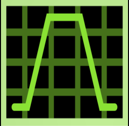
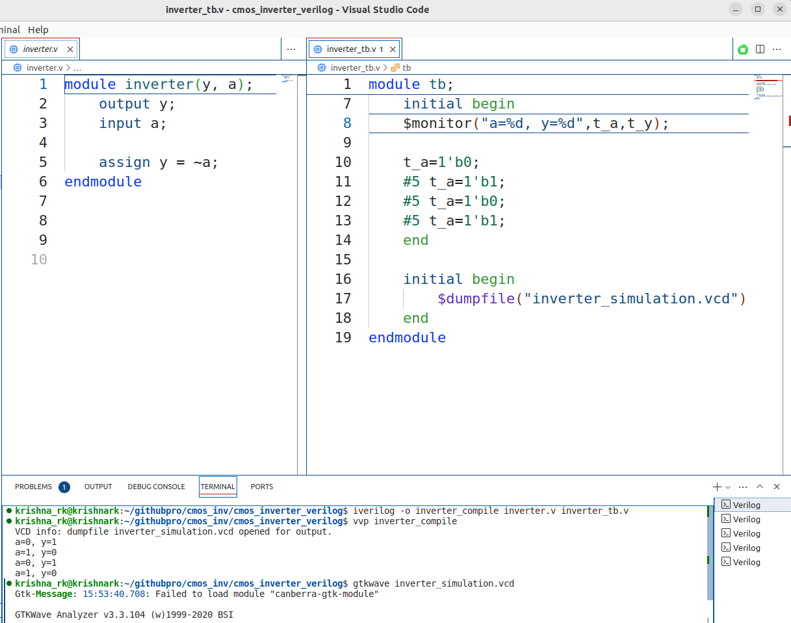

# Design and Analysis of CMOS Inverter: Schematic Design, Layout Design and LVS Validation using SKY130 PDK

#### This project involves the comprehensive design and analysis of a CMOS inverter. The schematic design was created using Xschem and simulated with Ngspice to verify electrical characteristics. The layout was designed with Magic VLSI, ensuring adherence to design rules.A behavioral description was written in Verilog and verified using Icarus Verilog. The Verilog code was synthesized into RTL using Yosys. Layout Versus Schematic (LVS) verification was performed using Netgen to ensure consistency between schematic and layout.All these steps were executed using the open-source SKY130 PDK. 

## Contents
- [1. Introduction](#1-Introduction)
  - [1.1. Objective](#11-Objective)

- [2. Tools and PDK](#2-Tools-and-PDK)
  - [2.1 SKY130PDK](#21-SKY130PDK)
  - [2.2 Icarus Verilog](#22-Icarus-Verilog)
  - [2.3 GTK Wave](#23-GTK-Wave)
  - [2.4 Yosys](#24-Yosys)
  - [2.5 Xschem](#25-Xschem)
  - [2.6 Ngspice](#26-Ngspice)
  - [2.7 Magi VLSI](#27-Magi-VLSI)
  - [2.8 Netgen](#28-Netgen)

- [3. Schematic Analysis](#3-Schematic-Analysis)
  - [3.1 Schematic Circuit](#31-Schematic-Circuit)
  - [3.2 Voltage Transfer Characteristics](#32-Voltage-Transfer-Characteristics)
  - [3.3 Noise Analysis](#33-Noise-Analysis])
  - [3.4 Delay Analysis](#34-Delay-Analysis)
  - [3.5 Power Analysis](#35-Power-Analysis)

- [4. Layout Design](#4-Layout-Design)
  - [4.1 Inverter Layout Design](#41-Inverter-Layout-Design)
  - [4.2 Magic VLSI SPICE file](#42-Magic-VLSI-SPICE-file)

- [5. Behavioural Description](#5-Behavioural-Descriptio)
  - [5.1 Verilog Inverter Design](#51-Verilog-Inverter-Design)
  - [5.2 GTK Wave](#52-GTK-Wave)
 
- [6.RTL Logic Synthesis](#6-RTL-Logic-Synthesis)
  - [6.1 Yosys Synthesis](#61-Yosys-Synthesis)
  
 
- [7. Layout Versus Schematic](#7-Layout-Versus-Schematic)
  - [7.1 LVS Ngspice Simulation](#71-LVS-Ngspice-Simulation)
 

- [8. Conclusion](#8-Conclusion)

## 1. Introduction

### Project Introduction

This project focuses on the comprehensive design and analysis of a CMOS inverter using the SKY130 PDK. The design process begins with schematic creation and circuit simulation, employing Xschem for schematic capture and Ngspice for detailed simulation. The layout design of the inverter is then performed using Magic VLSI, ensuring that the physical layout adheres to design rules and matches the schematic.

To validate the design, a behavioral description of the CMOS inverter is created using Verilog code, which is then simulated using Icarus Verilog. The RTL synthesis of the Verilog code is carried out using Yosys, providing a gate-level representation of the design. Layout versus Schematic (LVS) verification is performed using Netgen to ensure that the physical layout accurately represents the schematic design.

The project includes thorough analysis of Voltage Transfer Characteristics (VTC), power consumption, propagation delay, and noise margins to ensure optimal performance and reliability of the inverter. Additionally, the design process involves creating visual representations of the netlist using NetlistSVG and generating RTL netlists with GraphViz to facilitate better understanding chip design flow.


## 2. Tools and PDK

### 2.1 SKY130PDK


The [SkyWater 130nm Process Design Kit (PDK)](https://skywater-pdk.readthedocs.io/en/main/index.html#) is an open-source toolset provided by SkyWater Technology, tailored for semiconductor design at the 130nm technology node. It includes essential components such as design rules, device models, and standard cell libraries. The purpose of the SkyWater 130nm PDK is to enable designers to create and simulate integrated circuits with accuracy and efficiency. It supports both analog and digital circuit design, making it suitable for a wide range of applications from consumer electronics to advanced research in semiconductor technology.

### 2.2 Icarus Verilog


[Icarus Verilog ](https://iverilog.fandom.com/wiki/Installation_Guide)is an open-source Verilog simulation and synthesis tool. It supports both the IEEE-1364 and IEEE-1800 standards, providing a robust environment for compiling and simulating Verilog designs. Icarus Verilog is widely used in educational and research settings due to its flexibility and free availability.

### 2.3 GTK Wave



[GTKWave ](https://gtkwave.sourceforge.net/)is an open-source waveform viewer that allows users to view simulation results of digital circuits. It supports several waveform formats, including VCD (Value Change Dump) files, which are commonly generated by simulators like Icarus Verilog. GTKWave provides a user-friendly interface for analyzing signal transitions and debugging digital designs.

### 2.4 Yosys


[Yosys](https://yosyshq.net/yosys/) is an open-source framework for Verilog RTL synthesis. It allows designers to convert Verilog code into gate-level netlists, supporting various FPGA and ASIC technologies. Yosys is highly extensible, offering a modular architecture that enables users to add custom synthesis algorithms and optimizations. It is widely used in conjunction with other open-source EDA tools for complete digital design workflows.

### 2.5 Xschem


[Xschem](https://xschem.sourceforge.io/stefan/index.html) is coupled with the SkyWater 130nm Process Design Kit (PDK) and Ngspice, forms a robust toolchain for VLSI circuit design and simulation. Xschem serves as a powerful schematic capture tool, providing an intuitive interface for designing and analyzing circuits at the transistor level. Integrated with the SkyWater 130nm PDK, Xschem facilitates efficient creation and editing of circuit schematics, ensuring compatibility with specific design rules and device models. Ngspice complements Xschem by enabling accurate simulation of analog and mixed-signal circuits, crucial for predicting and validating circuit behavior before fabrication. Together, they enhance the precision and effectiveness of semiconductor design processes.
**[Learn more about Xschem](https://xschem.sourceforge.io/stefan/xschem_man/xschem_man.html")**

### 2.6 Ngspice


[Ngspice](https://ngspice.sourceforge.io/) in conjunction with Xschem and the SkyWater 130nm Process Design Kit (PDK), is pivotal for simulating VLSI circuits with precision. It enables thorough analysis of analog and mixed-signal designs, predicting circuit performance and validating functionality before fabrication. Integrated seamlessly with Xschem and utilizing the comprehensive device models and design rules of the SkyWater 130nm PDK, Ngspice supports various simulation types, including transient and AC/DC analyses. This combination ensures that designers can achieve accurate and reliable results, optimizing circuits for performance, power efficiency, and overall design robustness in semiconductor applications.

**[Get Ngspice Manual Here!](https://ngspice.sourceforge.io/docs/ngspice-manual.pdf)**

### 2.7 Magi VLSI


[Magic VLSI](http://opencircuitdesign.com/magic/) is an open-source layout tool for designing and editing integrated circuit layouts. It is particularly known for its simple and intuitive user interface. Magic supports various fabrication technologies, including the SKY130 PDK, and provides features for design rule checking (DRC), layout versus schematic (LVS) checking, and extraction of circuit parameters.

### 2.8 Netgen


[Netgen](http://opencircuitdesign.com/netgen/) is an open-source tool for comparing netlists and performing layout versus schematic (LVS) checks. It verifies that the physical layout of a circuit matches its schematic design. Netgen is compatible with multiple EDA tools and supports integration with Magic VLSI for comprehensive design verification.

To install follow **[All Tools](https://xschem.sourceforge.io/stefan/xschem_man/tutorial_xschem_sky130.html)** the instructions provided in this site.


## 3. Schematic Analysis

### 3.1 Schematic Circuit 


An inverter was designed in Xschem using components from the SKY130 PDK, specifically pfet_01v8 and nfet_01v8. The inputs ("in", "vdd", and "gnd") were connected using ipin.sym, while the output ("out") was connected with opin.sym. After constructing the circuit, a symbol was created using the Xschem symbol creation feature (Press A). The inverter symbol was then refined using the polygon tool to accurately represent the inputs and outputs.Following this, a testbench for the inverter was developed to facilitate further analysis. This setup ensures that the schematic captures all necessary connections and parameters required for accurate simulation and testing of the inverter’s performance in subsequent stages.


### 3.2 Voltage Transfer Characteristics


A .dc analysis was performed using Ngspice to plot the input voltage (vin) against the output voltage (vout), focusing on determining the tripping point (Vm) of the inverter. Initially, the W/L ratio was set to 2, and the Vm was found to be 0.869V, slightly less than the desired 0.9V.Increasing the size to 4 achieved a Vm of 0.905V, indicating a more accurate tripping point but at the cost of larger area consumption in the chipset. Consequently, a size of 2 was chosen, balancing accuracy and area efficiency.


This tripping point is critical as it defines the transition between logic 0 and logic 1, adhering to the thumb rule where Vm should be approximately half of Vdd. The analysis underscores the importance of optimizing the inverter's design to achieve a precise Vm, which is essential for reliable logic level determination in digital circuits.


### 3.3 Noise Analysis


Noise analysis is essential to understand the inverter's behavior in the presence of unwanted signals. MOSFETs amplify noise due to their transconductance (gm) and output resistance (Ro). The gain range over which the noise is amplified was identified.For the inverter, the input voltage range considered as logic 0 (VIL) was up to 0.7435V, and the range for logic 1 (VIH) was after 0.980V. Corresponding output voltages were 1.748V (VOH) for VIL and 0.6747V (VOL) for VIH. 


This analysis ensures that transitions avoid noise amplification regions, maintaining signal integrity. By identifying these noise margins, the design can be optimized to minimize susceptibility to noise, which is crucial for the stability and reliability of high-speed digital circuits.


### 3.4 Delay Analysis


Propagation delays were measured to evaluate the inverter's response time. The high-to-low propagation delay (tpHL) was 0.254 ps, and the low-to-high propagation delay (tpLH) was 0.398 ps, calculated from the time the input reaches 50% to the output reaching 50% of its final value.Additionally, the rise time (tr) was 0.634 ps, and the fall time (tf) was 0.512 ps. These metrics are crucial for understanding the speed performance of the inverter in digital circuits. Accurate delay analysis ensures that the inverter can operate effectively within the timing constraints of complex VLSI systems, thereby enhancing overall circuit performance.


### 3.5 Power Analysis


Power consumption of the inverter was analyzed over a single cycle, focusing on the second cycle. By plotting Vdd#branch in Ngspice, the current was measured, and the average power was calculated using the formula:


where \( T \) is the time period, \( id \) is the current flow, and \( Vdd \) is the supply voltage.


 The measured average power was 0.814 µW. This power analysis is critical for designing energy-efficient circuits, which is particularly important in battery-powered and portable devices. By optimizing power consumption, the overall efficiency and longevity of the electronic system can be significantly improved.


**[Click Here](https://github.com/Balakrishna-RK/Balakrishna-RK/tree/main/Projects/Design_and_Analysis_of_CMOS_Inverter%3A_Schematic_Design_Layout_Design_and_LVS_Validation_using_SKY130_PDK/assets/files/schematic_design) to get Schematic Design Files.**


## 4. Layout Design

### 4.1 Inverter Layout Design


The layout design for the inverter was created using the Magic VLSI tool, adhering to the principle that the PMOS transistor should be twice the size of the NMOS transistor. The technology was set to SKY130A by accessing the tech manager from the options menu. To achieve a symmetrical area, the commands grid 50nm 50nm and snap user 50nm were executed in the tkcon window.


The inverter layout was designed according to the layer diagram provided by the SKY130 PDK. Regular Design Rule Check (DRC) was performed using the command drc find in the tkcon window or the DRC manager in the options menu to ensure compliance with design rules. The finalized layout is shown below.

### 4.2 Magic VLSI SPICE file

A SPICE file was extracted from the layout using Magic VLSI. The commands extract all and ext2spice were used to convert the layout (.ext) file to a SPICE (.spice) file. This SPICE file includes the design and connections of the inverter, allowing for Layout versus Schematic (LVS) analysis with Ngspice.


## 5. Behavioural Description

### 5.1 Verilog Inverter Design



For larger circuit designs, breaking down the design into smaller, manageable blocks is essential. A behavioral description of the inverter was created using Verilog for logic synthesis. The design was verified using a testbench file in Icarus Verilog and visualized with GTKWave to ensure correct functionality. This step is crucial for verifying that the design behaves as intended before proceeding to more complex synthesis stages.

### 5.2 GTK Wave

GTKWave was used to graphically analyze the input and output signals of the inverter from the testbench. This tool helps in verifying the inverter's functionality by providing a visual representation of the signals, ensuring that the inverter operates correctly according to the design specifications.

**[Click here](/assets/files/cmos_inverter_verilog) to get Behavioural Code**

## 6. RTL Logic Synthesis

### 6.1 Yosys Synthesis

#### Yosys Commands


Yosys, a free and powerful synthesis tool, was used for logic synthesis of the Verilog code. Yosys converts the behavioral Verilog description into a gate-level netlist, facilitating verification and analysis of the Finite State Machine (FSM) and overall circuit synthesis. The synthesis process includes generating a NetlistSVG with JSON and visualizing the logic synthesis with GraphViz. Commands for these operations are executed in the Yosys terminal. The resulting JSON can be rendered using an appropriate online tool, while the .dot file can be viewed with the xdot command in the terminal.

```
$ read_verilog inverter.v
$ hierarchy -check -top inverter
$ read_verilog -lib cmos_cells.lib
$ synth
$ dfflibmap -liberty cmos_cells.lib
$ opt_clean
$ write_verilog synth.v
$ help write_json
$ write_json synth.json
```
##### Continue with Above Commands for GraphViz :
```
$ help show
$ show -prefix synth -notitle -colors 2 -width -format dot
```
##### Open synth.dot in Directory
```
$ xdot synth.dot &
```
To get Gate level synthesis using JSON, we can install [NetlistSVG](https://github.com/nturley/netlistsvg) to convert the synth.json file into NetlistSVG Gate level synthesis. Another way, we can directly convert the .json file through this [Website](https://neilturley.dev/netlistsvg/).


The below shows the RTL Gate Level Synthesis achieved through Yosys along [GraphViz](https://yosyshq.net/yosys/screenshots.html),


**[Click here](/assets/files/cmos_inverter_verilog) to get Yosys Files**

## 7. Layout Versus Schematic

### 7.1 LVS Ngspice Simulation


Layout versus Schematic (LVS) verification was performed using the SPICE file generated by Magic VLSI. A testbench SPICE file was created in a text editor, including the appropriate .lib for the SKY130 PDK. The design was verified by comparing plots of the layout design against the schematic design using Ngspice. The command ngspice cmos_inverter_ngspice.spice was used to simulate and plot Vin and Vout for verification. This ensured that the schematic and layout matched perfectly, achieving a fabrication-ready layout.


## 8. Conclusion

