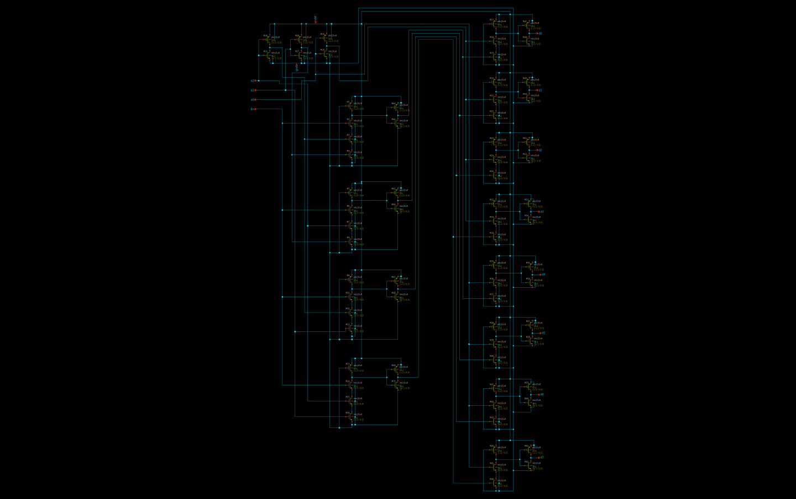
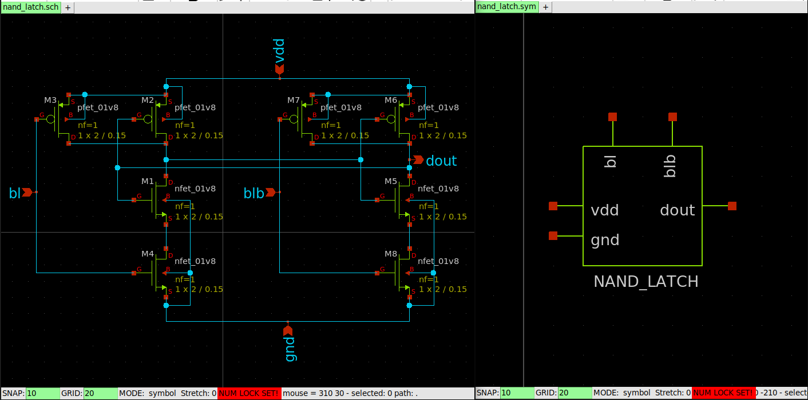
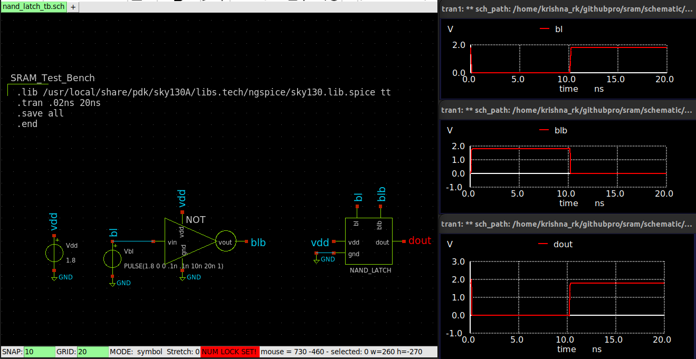
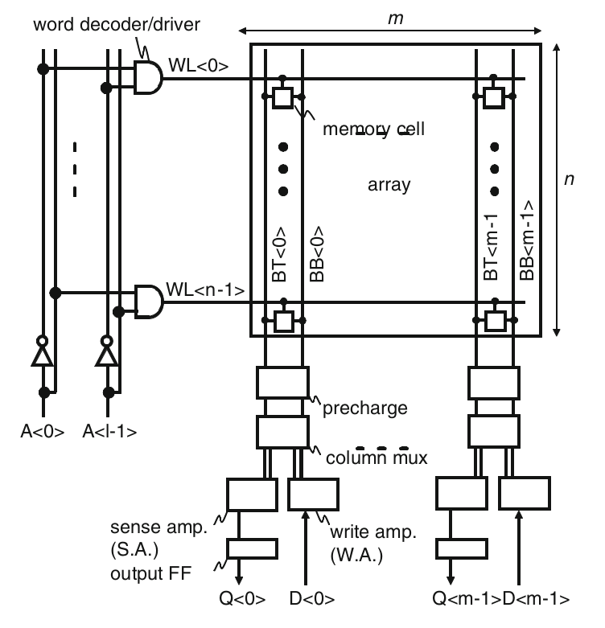

# Design and Analysis of 8-bit Carry Select Adder: Schematic Design, Layout Design and LVS Validation using SKY130PDK

#### The project involves the schematic design and analysis of an 8-bit 8-word Static RAM (SRAM) using Xschem, integrated with the SkyWater 130nm Process Design Kit (SKY130PDK), and simulated using Ngspice. SRAM is a type of semiconductor memory that uses bistable latching circuitry to store each bit. This SRAM design consists of 8 words, each 8 bits in size, organized to allow for efficient data storage and retrieval.The design process begins with the creation of the SRAM schematic in Xschem, leveraging the components and models provided by the SKY130PDK.The next step involves gate-level synthesis, performed using Yosys, to translate the high-level schematic into a netlist suitable for layout and fabrication.

## Contents
- [1. Introduction](#1-Introduction)

- [2. Tools and PDK](#2-Tools-and-PDK)
  - [2.1 SKY130PDK](#21-SKY130PDK)
  - [2.2 Icarus Verilog](#22-Icarus-Verilog)
  - [2.3 GTK Wave](#23-GTK-Wave)
  - [2.4 Yosys](#24-Yosys)
  - [2.5 Xschem](#25-Xschem)
  - [2.6 Ngspice](#26-Ngspice)
  - [2.7 Magi VLSI](#27-Magi-VLSI)
  - [2.8 Netgen](#28-Netgen)

- [3. HDL Description and Synthesis](#3-HDL-Description-and-Synthesis)
  - [3.1 SRAM HDL Description](#31-RAM-HDL-Description)
  - [3.2 Gate Level Synthesis](#32-Gate-Level-Synthesis)

- [4. 6T SRAM CELL Design](#4-6T-SRAM-CELL-Design)

- [5. Sense Amplifier Design](#5-Sense-Amplifier-Design)
 
- [6. Address Decoder Design](#6-Address-Decoder-Design)

- [7. NAND Latch Design](#7-NAND-Latch-Design)

- [8. Precharge Block Design](#8-Precharge-Block-Design)

- [9. Write Amplifier Design](#9-Write-Amplifier-Design)

- [10. 8-Word 8-Bit SRAM Design](#9-8-Word-8-Bit-SRAM-Design)
  
- [11. Conclusion](#11-Conclusion)

- [12. References](#12-References)

## 1. Introduction
  The project involves the schematic design and analysis of an 8-bit, 8-word Static RAM (SRAM) using Xschem integrated with the SKY130 Process Design Kit (PDK) and simulated using Ngspice. Gate-level synthesis is achieved using Yosys. SRAM is a type of volatile memory that uses bistable latching circuitry to store each bit, providing fast access and low power consumption. The 6T SRAM cell, the fundamental building block of this SRAM, consists of six transistors: two cross-coupled inverters forming a bistable latch and two access transistors connecting the latch to the bitlines.

  
  Data is written or read by selecting the appropriate cell using a row decoder, which connects to the Wordline (WL) of the 6T SRAM cell, and a column decoder, which connects to the Bitline (BL) and Bitline Bar (BLB). The row decoder activates the WL to select a row of cells, while the column decoder selects the bitlines to read or write data. This design ensures efficient memory access and reliable data storage, with the decoders facilitating precise selection and manipulation of individual cells within the array.

## 2. Tools and PDK

### 2.1 SKY130PDK

The [SkyWater 130nm Process Design Kit (PDK)](https://skywater-pdk.readthedocs.io/en/main/index.html#) is an open-source toolset provided by SkyWater Technology, tailored for semiconductor design at the 130nm technology node. It includes essential components such as design rules, device models, and standard cell libraries. The purpose of the SkyWater 130nm PDK is to enable designers to create and simulate integrated circuits with accuracy and efficiency. It supports both analog and digital circuit design, making it suitable for a wide range of applications from consumer electronics to advanced research in semiconductor technology.

### 2.2 Icarus Verilog

[Icarus Verilog ](https://iverilog.fandom.com/wiki/Installation_Guide)is an open-source Verilog simulation and synthesis tool. It supports both the IEEE-1364 and IEEE-1800 standards, providing a robust environment for compiling and simulating Verilog designs. Icarus Verilog is widely used in educational and research settings due to its flexibility and free availability.

### 2.3 GTK Wave

[GTKWave ](https://gtkwave.sourceforge.net/)is an open-source waveform viewer that allows users to view simulation results of digital circuits. It supports several waveform formats, including VCD (Value Change Dump) files, which are commonly generated by simulators like Icarus Verilog. GTKWave provides a user-friendly interface for analyzing signal transitions and debugging digital designs.

### 2.4 Yosys

[Yosys](https://yosyshq.net/yosys/) is an open-source framework for Verilog RTL synthesis. It allows designers to convert Verilog code into gate-level netlists, supporting various FPGA and ASIC technologies. Yosys is highly extensible, offering a modular architecture that enables users to add custom synthesis algorithms and optimizations. It is widely used in conjunction with other open-source EDA tools for complete digital design workflows.

### 2.5 Xschem

[Xschem](https://xschem.sourceforge.io/stefan/index.html) is coupled with the SkyWater 130nm Process Design Kit (PDK) and Ngspice, forms a robust toolchain for VLSI circuit design and simulation. Xschem serves as a powerful schematic capture tool, providing an intuitive interface for designing and analyzing circuits at the transistor level. Integrated with the SkyWater 130nm PDK, Xschem facilitates efficient creation and editing of circuit schematics, ensuring compatibility with specific design rules and device models. Ngspice complements Xschem by enabling accurate simulation of analog and mixed-signal circuits, crucial for predicting and validating circuit behavior before fabrication. Together, they enhance the precision and effectiveness of semiconductor design processes.
**[Learn more about Xschem](https://xschem.sourceforge.io/stefan/xschem_man/xschem_man.html")**

### 2.6 Ngspice

[Ngspice](https://ngspice.sourceforge.io/) in conjunction with Xschem and the SkyWater 130nm Process Design Kit (PDK), is pivotal for simulating VLSI circuits with precision. It enables thorough analysis of analog and mixed-signal designs, predicting circuit performance and validating functionality before fabrication. Integrated seamlessly with Xschem and utilizing the comprehensive device models and design rules of the SkyWater 130nm PDK, Ngspice supports various simulation types, including transient and AC/DC analyses. This combination ensures that designers can achieve accurate and reliable results, optimizing circuits for performance, power efficiency, and overall design robustness in semiconductor applications.

**[Get Ngspice Manual Here!](https://ngspice.sourceforge.io/docs/ngspice-manual.pdf)**

### 2.7 Magi VLSI

[Magic VLSI](http://opencircuitdesign.com/magic/) is an open-source layout tool for designing and editing integrated circuit layouts. It is particularly known for its simple and intuitive user interface. Magic supports various fabrication technologies, including the SKY130 PDK, and provides features for design rule checking (DRC), layout versus schematic (LVS) checking, and extraction of circuit parameters.

### 2.8 Netgen

[Netgen](http://opencircuitdesign.com/netgen/) is an open-source tool for comparing netlists and performing layout versus schematic (LVS) checks. It verifies that the physical layout of a circuit matches its schematic design. Netgen is compatible with multiple EDA tools and supports integration with Magic VLSI for comprehensive design verification.

To install follow **[All Tools](https://xschem.sourceforge.io/stefan/xschem_man/tutorial_xschem_sky130.html)** the instructions provided in this site.

## 3. HDL Description and Synthesis

### 3.1 SRAM HDL Description

### 3.2 Gate Level Synthesis

## 4. 6T SRAM CELL Design
A 6T SRAM cell consists of six transistors: two PMOS (M4 and M2), two NMOS (M3 and M1), and two additional NMOS (M5 and M6) that connect to the bitlines. The PMOS transistors (M4 and M2) have a larger W/L ratio compared to the bitline NMOS transistors (M5 and M6), and the NMOS transistors (M3 and M1) are also sized larger than M5 and M6. This sizing strategy ensures that the cell can hold its state reliably during read and write operations. When one bitline is driven high, the corresponding bitline bar is pulled low, causing one of the cross-coupled inverters' outputs to be high and the other to be low. This differential signal between the bitlines reinforces the latched state of the inverters, maintaining the stored bit. The larger transistors (M3 and M1) enhance the drive strength for maintaining the stored value, while the bitline NMOS transistors (M5 and M6) facilitate the read and write access by connecting the cell to the bitlines during these operations.

### Write Operation
For a 6T SRAM cell write operation:

- Drive one bitline high and the other low.
- Turn on the wordline.
- Bitlines overpower the cell with the new value.
- Writability:
  - Must overpower the feedback inverter (M5 >> M4).

This behavior ensures that the new data is successfully written into the 6T SRAM cell by leveraging the stronger bitline transistors (M5 and M6) to overpower the feedback from the cell's cross-coupled inverters (M1-M4).

### Read Operation
For a 6T SRAM cell read operation:

- Precharge both bitlines high.
- Turn on the wordline.
- One of the two bitlines will be pulled down by the cell.
- Read stability:
  - The stored value (Q) must not flip.
  - The pull-down NMOS transistor (M3) must be stronger than the access NMOS transistor (M5) (M3 >> M5).

This behavior ensures that the stored data is read correctly without altering the state of the 6T SRAM cell, maintaining its stability during the read operation.

## 5. Sense Amplifier Design

  A sense amplifier in an SRAM (Static Random Access Memory) is a crucial component that plays a vital role in reading the stored data. I used a latch-type sense amplifier, where the primary function is to detect and amplify the small voltage differences that represent the stored binary data in the SRAM cells. This type of sense amplifier consists of a pair of cross-coupled inverters that form a bistable latch, which can quickly and reliably determine the state of the bitline pair during a read operation. When a read operation is initiated, the bitlines are precharged to an intermediate voltage. The small difference in voltage, caused by the charge stored in the selected SRAM cell, is sensed by the sense amplifier. 
  
   
  
  The cross-coupled inverters then latch onto the stronger signal, amplifying it to a full logic level, ensuring a fast and accurate read operation. Latch-type sense amplifiers are preferred in high-speed SRAM designs due to their quick response time and robustness against noise, making them essential for the efficient performance of modern SRAM systems. The schematic design using Xschem and simulation with Ngspice is shown. After precharging the bitlines, enable the YSR for read operation and enable SE (Sense enable) and SE' (Sense enable bar) of the sense amplifier to activate it.

   
  
 
## 6. Address Decoder Design
An address decoder in SRAM (Static Random Access Memory) is an essential component responsible for selecting the appropriate memory cells for read and write operations based on the provided address. The 3:8 decoder is a crucial element in both row and column decoders in SRAM, enabling the selection of one out of eight possible rows or columns by decoding a 3-bit address input. This decoder design effectively simplifies the addressing mechanism, allowing for efficient and accurate access to the memory cells. In this implementation, a pseudo NMOS AND gate is used to design the decoder, which reduces the logical effort by minimizing the size and power consumption typically associated with PMOS transistors. This approach enhances the overall speed and efficiency of the decoding process. The output from XSchem and Ngspice simulations validates the functionality and performance of the 3:8 decoder in the SRAM design, demonstrating its capability to handle the addressing needs of high-speed memory operations. The pseudo NMOS AND gate's effectiveness in lowering logical effort contributes significantly to the optimized performance of the SRAM.

The 3:8 decoder circuit design in Xschem has been completed, and a symbol for the decoder has been created. A test bench was set up to verify the outputs, ensuring the functionality and accuracy of the decoder. This verification process confirms that the 3:8 decoder correctly decodes the 3-bit address input to select one out of eight possible outputs, as expected.

## 7. NAND Latch Design
The NAND latch is an integral component used to obtain the output from the sense amplifier in SRAM. It consists of two NAND gates connected in a cross-coupled configuration, forming a stable latch that captures and holds the read output from the 6T SRAM cell. When the sense amplifier provides the differential outputs SA and SA', the NAND latch receives these signals and latches the read data. Each row in the SRAM array has one NAND latch connected to its output through a read decoder, ensuring that the correct data is read from the selected memory cell. This setup enables reliable data retrieval and maintains the integrity of the stored information during read operations.

## 8. Precharge Block Design

In SRAM systems, the precharge block plays a crucial role in preparing the bitlines for accurate data reading from the 6T SRAM cell. Prior to reading, the bitlines are precharged to a voltage level, typically Vdd/2, using PMOS transistors M1 and M2. This precharging process ensures that both bitlines start from a balanced state, minimizing potential noise and improving the accuracy of the subsequent read operation. The PMOS transistor M3 is used to equalize the bitlines, ensuring that they are at the same voltage level before the read phase begins. Once precharging is complete, the word line and the YSR (sense amplifier read enable) are activated to initiate the read process. This configuration allows the sense amplifier to accurately detect and amplify the small voltage differences between the bitlines, reflecting the stored data from the SRAM cell. The effective use of these transistors in the precharge block enhances the reliability and performance of SRAM memory reads.

## 9. Write Amplifier Design

In SRAM (Static Random Access Memory), the write amplifier is a critical component responsible for ensuring that data is accurately written to the SRAM cells. When a write operation is initiated, the write decoder sends the data to be written into the SRAM. The write amplifier plays a pivotal role in converting this data into a suitable form for the bitlines and bitline bar. Specifically, when the YSR (sense amplifier read enable) is activated, the data input (Din) is directed to the write amplifier, which then processes and amplifies the signals to drive the bitlines. The write amplifier typically consists of a buffer for the bitline and an inverter to generate the complementary signal for the bitline bar. This configuration ensures that the correct voltage levels are applied to the bitlines.

## 10. 8-Word 8-Bit SRAM Design
The 8-word, 8-bit SRAM operates by utilizing a structured arrangement of memory cells, address decoders, and read/write circuitry to facilitate efficient data storage and retrieval. The SRAM array consists of 8 rows and 8 columns, with each cell capable of storing a single bit of data. When a read operation is initiated, the address decoder selects the appropriate row and column based on the 3-bit address input, enabling the corresponding bitlines. The bitlines are precharged to a balanced voltage level using PMOS transistors, preparing them for accurate data reading. 

The sense amplifier, configured with a latch-type design, detects and amplifies the small voltage differences between the bitlines to reflect the stored data. For writing data, the write decoder activates the write amplifier, which processes the data input and drives the bitlines accordingly. The write amplifier consists of a buffer for the bitline and an inverter for the bitline bar, ensuring that the correct voltage levels are applied to write data into the selected SRAM cells. This coordinated process of addressing, precharging, sensing, and writing allows the 8-word, 8-bit SRAM to efficiently manage data operations with reliability and speed. The read operation begins with the activation of the selected word line. Prior to this, the precharge circuit equalizes the bitline voltages to VDD. Each SRAM cell generates a small voltage difference, ΔVs, on one of the bitlines, depending on the stored data.

If the stored data is "1," the cell node N0 is at a low voltage while node N1 is at a high voltage, causing the voltage on the bitline to decrease by ΔVs. The complementary bitline (BB) remains at the equalized voltage because the access transistor (DR1) is off. Differential signals are then transferred to the sense amplifier inputs (ST/SB) through the column switch selected by the column-select line for read (YSR) in the column multiplexer. The sense amplifier amplifies these signals, and the amplified data is latched by the NAND Latch to provide the data output (Dout) from the array. If the stored data is "0," the process is similar, except that the BB voltage decreases. For the write operation, the selected word line is activated after the bitlines have been equalized to approximately VDD. The write data voltage, corresponding to the data input (Din), is applied to the bitlines by the write amplifier (WA). The column switch is turned on by the column-select signal for write (YSW), transferring the write-data voltages to the bitlines. This causes the cell-node voltages (N1, N2) to flip. The write operation concludes with the deactivation of the word line.

#### SRAM Schematic Design
Using Xschem, we designed an 8-word, 8-bit SRAM and simulated it with Ngspice. For a simple simulation using the timing diagram, we wrote and read 8 bits of data to and from the 0th row. The simulation spanned 160ns, with data being written every 10ns and read during the next 10ns. For the write operation, the row decoder and write decoder were enabled using En and Enwr, and the bitlines were selected. YSW was enabled to write through the bitlines. For the read operation, the bitlines were precharged, and the row decoder was enabled simultaneously with YSR for the read operation. SE (sense enable) and SE' (sense enable bar) were enabled for the sense amplifier, and YSR was then disabled. By enabling the read decoder, the output could be read from Dout.

  
## 11. Conclusion

## Conclusion

The schematic and RTL design of the 8-word, 8-bit SRAM have provided valuable insights into the VLSI design flow and the intricate workings of SRAM, especially the importance of the timing diagram. This project has not only enhanced my understanding of the various steps involved in the VLSI design flow but also demonstrated the critical role of precise timing in the functionality and reliability of SRAM. The practical application of tools like Xschem and Ngspice, along with the integration of the SkyWater 130nm Process Design Kit (SKY130PDK), has been instrumental in solidifying my knowledge and skills in VLSI design.

## References
Here are the references in bullet points formatted in Markdown:

- Ishibashi, Koichiro, and Kenichi Osada, editors. *Low Power and Reliable SRAM Memory Cell and Array Design*. Springer, 2011.

- Abbas, Karim, editor. *Handbook of Digital CMOS Technology, Circuits, and Systems*. CRC Press, 2020.

